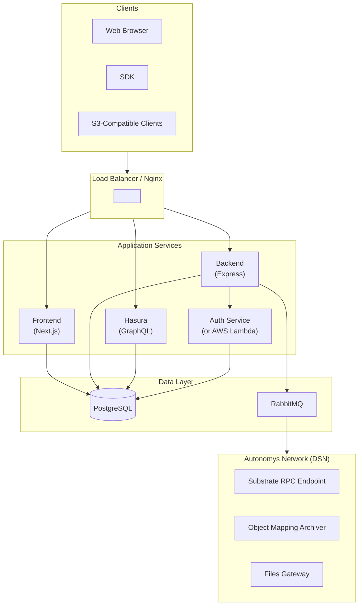
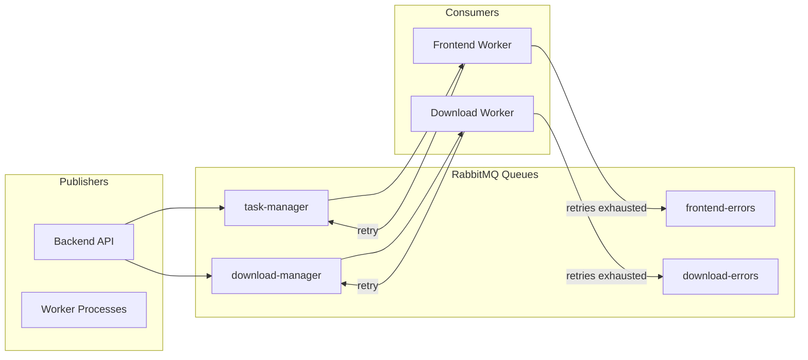
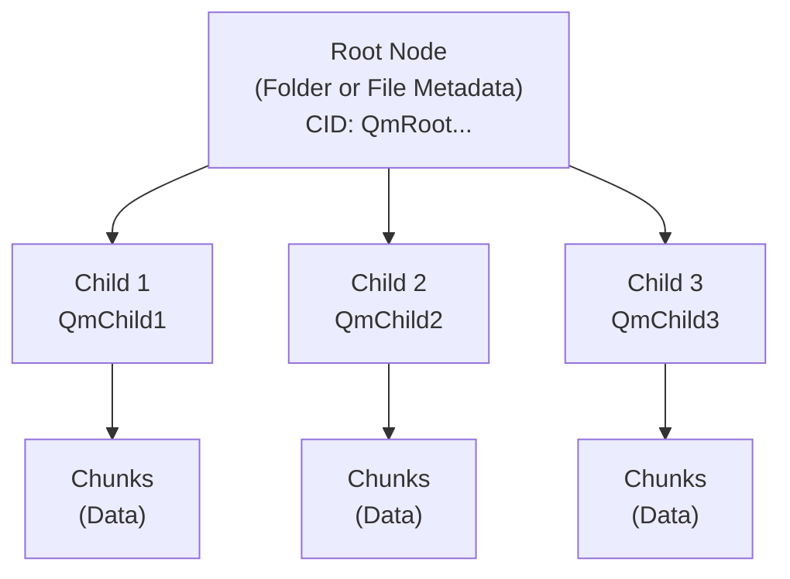
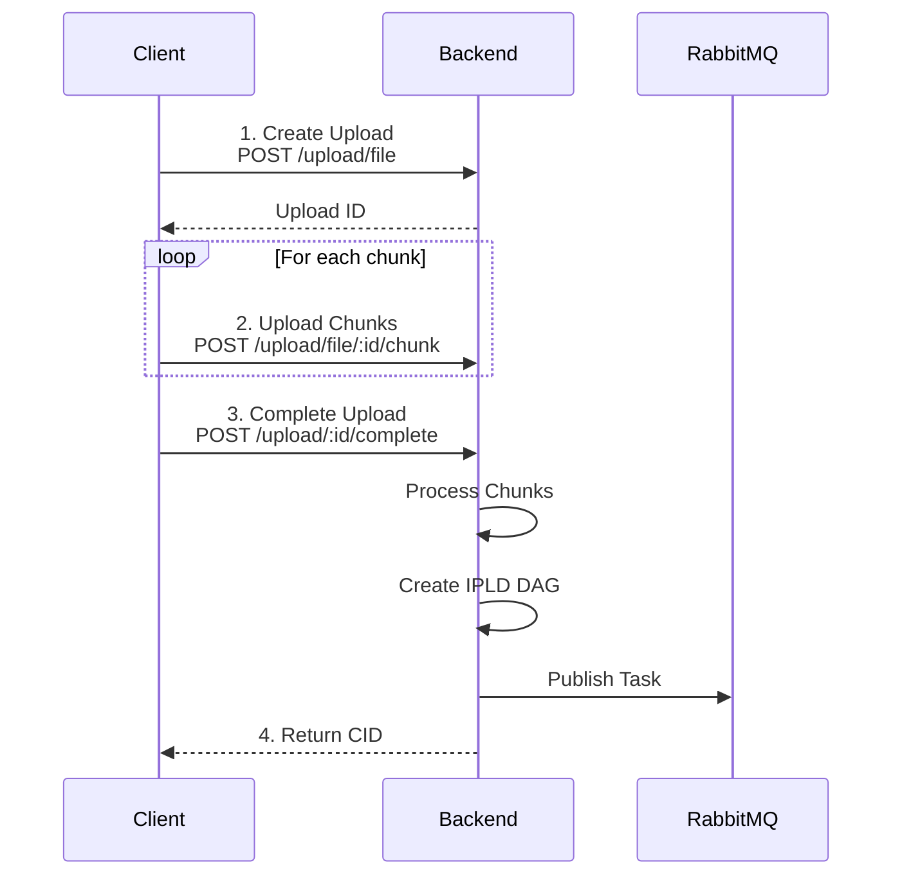
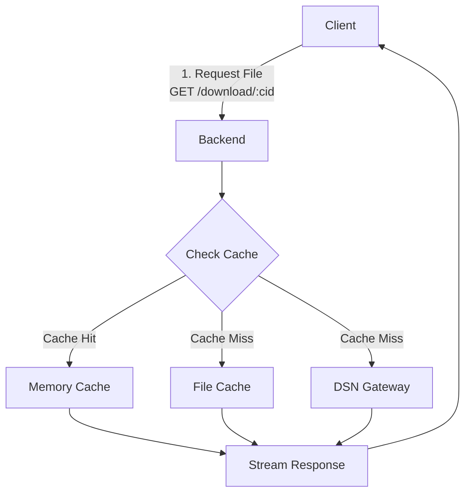
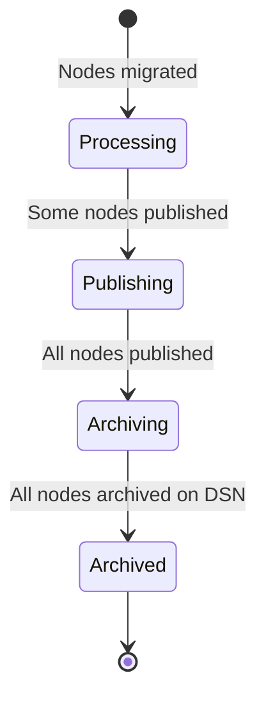
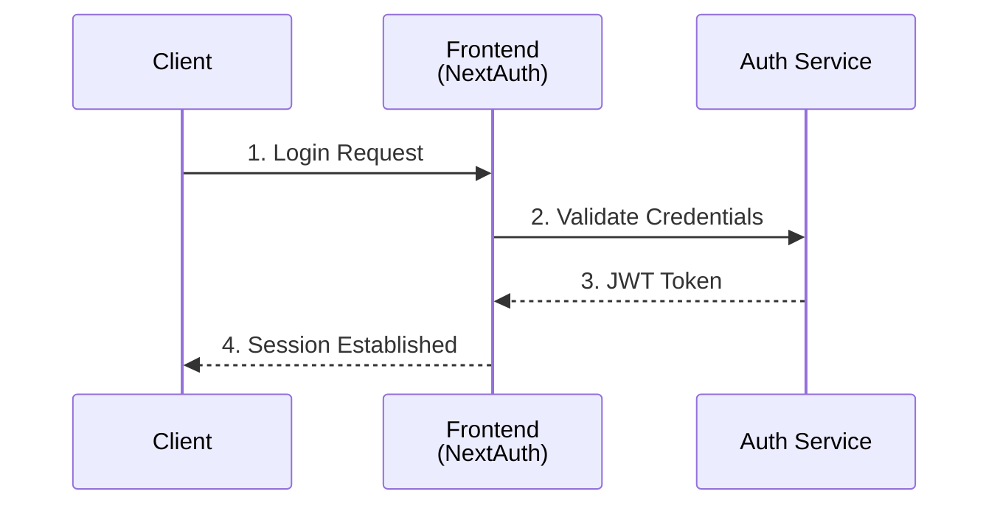
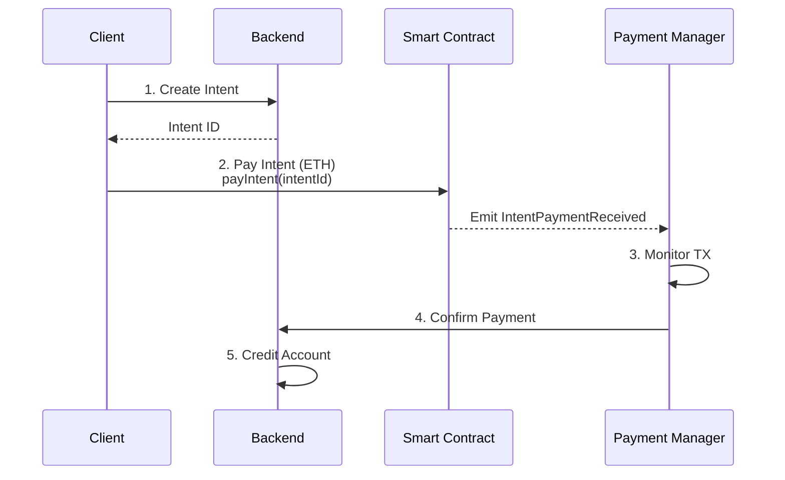

# Auto Drive Architecture

Auto Drive is a decentralized file storage platform built on the Autonomys Network. It provides permanent, immutable data storage using IPLD (InterPlanetary Linked Data) structures and publishes data to the Autonomys Distributed Storage Network (DSN).

## Table of Contents

- [High-Level Architecture](#high-level-architecture)
- [Service Components](#service-components)
  - [Backend Services](#backend-services)
  - [Auth Service](#auth-service)
  - [Frontend Application](#frontend-application)
  - [Hasura GraphQL Engine](#hasura-graphql-engine)
  - [Message Queue (RabbitMQ)](#message-queue-rabbitmq)
- [Data Layer](#data-layer)
  - [PostgreSQL Schema](#postgresql-schema)
  - [IPLD Data Structure](#ipld-data-structure)
- [Core Flows](#core-flows)
  - [Upload Flow](#upload-flow)
  - [Download Flow](#download-flow)
  - [File Lifecycle](#file-lifecycle)
- [Authentication & Authorization](#authentication--authorization)
- [Blockchain Integration](#blockchain-integration)
- [Payment System](#payment-system)
- [Shared Packages](#shared-packages)
- [Infrastructure & Deployment](#infrastructure--deployment)
- [API Reference](#api-reference)

---

## High-Level Architecture



---

## Service Components

### Backend Services

The backend is an Express.js application that runs as multiple server instances handling different concerns:

#### Frontend Server (`apps/backend/src/app/servers/frontend.ts`)

Primary API server handling:

- File uploads (chunked multipart uploads)
- Object metadata management
- User account operations
- S3-compatible API endpoints

#### Download Server (`apps/backend/src/app/servers/download.ts`)

Dedicated server for file retrieval:

- Synchronous downloads with streaming
- Asynchronous downloads for large files
- Multi-tier caching (memory + filesystem)

#### Worker Processes

Background workers process tasks from RabbitMQ:

- **Frontend Worker**: Handles upload processing, node migration, publishing
- **Download Worker**: Handles async download preparation, cache population

#### Core Architecture Layers

```
apps/backend/src/
├── app/                    # Application layer
│   ├── apis/              # Server initialization
│   ├── controllers/       # HTTP route handlers
│   ├── middlewares/       # Express middleware
│   └── servers/           # Server entry points
├── core/                   # Business logic layer
│   ├── downloads/         # Download use cases
│   ├── objects/           # Object/file management
│   ├── s3/               # S3-compatibility logic
│   ├── uploads/          # Upload processing
│   └── users/            # User account management
├── infrastructure/         # Infrastructure layer
│   ├── drivers/          # External service drivers
│   ├── eventRouter/      # RabbitMQ task routing
│   ├── repositories/     # Database access
│   └── services/         # External service integrations
└── shared/                 # Shared utilities
```

### Auth Service

The authentication service (`apps/auth/`) is a standalone microservice supporting:

#### Authentication Providers

| Provider      | Method                    | User Identifier |
| ------------- | ------------------------- | --------------- |
| Google OAuth  | Access token validation   | Email           |
| Discord OAuth | Access token validation   | Username        |
| GitHub OAuth  | Access token validation   | Login           |
| Web3 (SIWE)   | Signed message validation | Wallet address  |
| API Key       | Key lookup                | Key ID          |

#### Token Management

- **Access Tokens**: JWT with 1-hour expiry
- **Refresh Tokens**: 7-day expiry with revocation support
- **Hasura Claims**: Custom JWT claims for GraphQL authorization

```json
{
  "https://hasura.io/jwt/claims": {
    "x-hasura-default-role": "user",
    "x-hasura-allowed-roles": ["user"],
    "x-hasura-oauth-provider": "google",
    "x-hasura-oauth-user-id": "123456789",
    "x-hasura-organization-id": "org-uuid",
    "x-hasura-public-id": "user-uuid"
  }
}
```

#### Deployment Options

- **Development**: Express server on port 3030
- **Production**: AWS Lambda function

### Frontend Application

The frontend (`apps/frontend/`) is a Next.js 14 application providing:

#### Features

- File browser with folder navigation
- Drag-and-drop upload interface
- File preview and metadata viewing
- User authentication (OAuth + Web3 wallet)
- API key management
- Credit purchase flow
- Admin panel for content moderation

#### Tech Stack

- **Framework**: Next.js 14 with App Router
- **State Management**: Zustand, React Query
- **GraphQL**: Apollo Client
- **Styling**: Tailwind CSS
- **Web3**: RainbowKit, wagmi, viem
- **Authentication**: NextAuth.js

#### Key Routes

```
/[chain]/drive/              # Main file browser
/[chain]/drive/fs/[cid]      # File system view
/[chain]/drive/metadata/[cid] # File details
/[chain]/drive/shared/       # Shared files
/[chain]/drive/trash/        # Deleted files
/[chain]/drive/global/       # Global/public files
/[chain]/drive/search/[cid]  # Search results
/[chain]/drive/admin/        # Admin panel
/[chain]/drive/developers/   # API key management
/[chain]/drive/profile/      # User profile
/[chain]/drive/purchase/     # Credit purchase
/[chain]/explorer/[cid]      # Public file explorer
/authenticate                # Login page
/onboarding                  # New user setup
```

### Hasura GraphQL Engine

Hasura provides a GraphQL API layer on top of PostgreSQL:

- Auto-generated CRUD operations
- Row-level security using JWT claims
- Real-time subscriptions
- Relationship tracking

### Message Queue (RabbitMQ)

RabbitMQ handles asynchronous task processing with automatic retries and error handling.

#### Architecture



#### Task Types

| Task ID                   | Queue            | Description                     |
| ------------------------- | ---------------- | ------------------------------- |
| `migrate-upload-nodes`    | task-manager     | Move upload data to nodes table |
| `publish-nodes`           | task-manager     | Publish IPLD nodes on-chain     |
| `tag-upload`              | task-manager     | Add security tags to uploads    |
| `archive-objects`         | task-manager     | Mark objects as archived        |
| `ensure-object-published` | task-manager     | Verify on-chain publication     |
| `watch-intent-tx`         | task-manager     | Monitor payment transactions    |
| `async-download-created`  | download-manager | Prepare async download          |
| `object-archived`         | download-manager | Handle post-archival tasks      |
| `populate-cache`          | download-manager | Pre-populate download cache     |

#### Retry & Error Handling

Each task includes a `retriesLeft` counter (configured via `TASK_MANAGER_MAX_RETRIES`):

1. **On success**: Message is acknowledged and removed from queue
2. **On failure with retries remaining**: Task is re-published with decremented `retriesLeft`
3. **On failure with no retries**: Task is moved to the error queue (`frontend-errors` or `download-errors`)

```typescript
// Task structure
interface Task {
  id: string; // Task type identifier
  params: object; // Task-specific parameters
  retriesLeft: number; // Remaining retry attempts
}
```

#### Configuration

| Variable                   | Description                              |
| -------------------------- | ---------------------------------------- |
| `RABBITMQ_URL`             | Connection string                        |
| `RABBITMQ_PREFETCH`        | Max unacknowledged messages per consumer |
| `TASK_MANAGER_MAX_RETRIES` | Default retry count for new tasks        |

#### Implementation

```
apps/backend/src/infrastructure/
├── drivers/
│   └── rabbit.ts           # Connection, publish/subscribe, keepalive
└── eventRouter/
    ├── index.ts            # Task routing (queue selection)
    ├── tasks.ts            # Task schemas (Zod validation)
    ├── utils.ts            # Retry wrapper with error handling
    └── processors/
        ├── frontend.ts     # Upload/publish task handlers
        └── download.ts     # Download/cache task handlers
```

---

## Data Layer

### PostgreSQL Schema

#### Public Schema

**`metadata`** - Object metadata storage

```sql
CREATE TABLE public.metadata (
  root_cid TEXT NOT NULL,      -- Root CID of the object tree
  head_cid TEXT NOT NULL,      -- CID of this specific node
  metadata JSONB,              -- OffchainMetadata (name, size, type, etc.)
  name TEXT,                   -- Extracted filename
  is_archived BOOLEAN,         -- Whether fully archived on DSN
  tags TEXT[],                 -- Object tags (banned, insecure, etc.)
  PRIMARY KEY (root_cid, head_cid)
);
```

**`nodes`** - IPLD node storage

```sql
CREATE TABLE public.nodes (
  cid TEXT PRIMARY KEY,        -- Content identifier
  root_cid TEXT,               -- Root CID this node belongs to
  head_cid TEXT,               -- Head CID reference
  type TEXT,                   -- Node type (file, chunk, etc.)
  encoded_node TEXT,           -- Base64-encoded IPLD node data
  piece_index INTEGER,         -- DSN piece index after archival
  piece_offset INTEGER,        -- Offset within the piece
  block_published_on INTEGER,  -- Blockchain block number
  tx_published_on TEXT         -- Transaction hash
);
```

**`object_ownership`** - Ownership tracking

```sql
CREATE TABLE public.object_ownership (
  cid TEXT NOT NULL,
  oauth_provider TEXT NOT NULL,
  oauth_user_id TEXT NOT NULL,
  is_admin BOOLEAN,            -- Admin can share/delete
  marked_as_deleted TIMESTAMP, -- Soft delete timestamp
  PRIMARY KEY (cid, oauth_provider, oauth_user_id)
);
```

**`subscriptions`** - User subscription plans

```sql
CREATE TABLE public.subscriptions (
  id TEXT PRIMARY KEY,
  organization_id TEXT NOT NULL,
  granularity TEXT NOT NULL,   -- 'monthly', 'yearly', etc.
  upload_limit BIGINT NOT NULL,
  download_limit BIGINT NOT NULL
);
```

**`interactions`** - Usage tracking

```sql
CREATE TABLE public.interactions (
  id TEXT NOT NULL,
  subscription_id TEXT NOT NULL,
  type TEXT NOT NULL,          -- 'upload' or 'download'
  size BIGINT NOT NULL         -- Bytes transferred
);
```

**`intents`** - Payment intents

```sql
CREATE TABLE intents (
  id VARCHAR(255) PRIMARY KEY,
  user_public_id VARCHAR(255) NOT NULL,
  status VARCHAR(32) NOT NULL,
  tx_hash VARCHAR(255),
  payment_amount NUMERIC(78,0),
  shannons_per_byte NUMERIC(78,0)
);
```

#### Uploads Schema

Temporary storage during upload processing:

**`uploads.uploads`** - Upload sessions
**`uploads.blockstore`** - Temporary IPLD block storage
**`uploads.file_parts`** - Chunked upload parts
**`uploads.file_processing_info`** - Processing state

### IPLD Data Structure

Auto Drive uses IPLD (InterPlanetary Linked Data) for content-addressed storage:



#### Metadata Structure (OffchainMetadata)

```typescript
interface FileMetadata {
  type: 'file';
  dataCid: string;
  name: string;
  mimeType: string;
  totalSize: bigint;
  totalChunks: number;
  chunks: ChunkInfo[];
  uploadOptions?: {
    compression?: { algorithm: 'zlib' };
    encryption?: { algorithm: 'aes-256-gcm' };
  };
}

interface FolderMetadata {
  type: 'folder';
  dataCid: string;
  name: string;
  totalSize: bigint;
  children: ChildReference[];
}
```

---

## Core Flows

### Upload Flow



#### Upload Session States

The upload session tracks chunk collection:

| State       | Description                                 |
| ----------- | ------------------------------------------- |
| `PENDING`   | Upload session created, awaiting chunks     |
| `MIGRATING` | Chunks received, processing into IPLD nodes |
| `CANCELLED` | Upload was cancelled                        |
| `FAILED`    | Upload processing failed                    |

#### Object Status (Post-Upload)

Once nodes are migrated to public tables, object status is derived from node counts:

| Status       | Description                                    |
| ------------ | ---------------------------------------------- |
| `Processing` | Nodes being migrated to public tables          |
| `Publishing` | Nodes being published to blockchain            |
| `Archiving`  | All nodes published, awaiting DSN confirmation |
| `Archived`   | Fully stored on DSN                            |

### Download Flow



#### Caching Layers

1. **Memory Cache**: LRU cache for frequently accessed files
2. **Filesystem Cache**: SQLite-backed persistent cache
3. **DSN Gateway**: Direct retrieval from Autonomys Network

### File Lifecycle

Object status transitions (derived from node publication/archival counts):



See [file-lifecycle.md](./file-lifecycle.md) for detailed state transitions.

---

## Authentication & Authorization

### Authentication Flow



### Authorization Model

| Role        | Permissions                             |
| ----------- | --------------------------------------- |
| `anonymous` | Read public files, limited downloads    |
| `user`      | Upload, download, manage own files      |
| `app-admin` | Ban content, manage users, view reports |

### API Key Authentication

For programmatic access:

```http
Authorization: Bearer <api_key>
```

Or for S3-compatible endpoints:

```http
Authorization: AWS4-HMAC-SHA256 Credential=<access_key>...
```

---

## Blockchain Integration

### Autonomys Network

Auto Drive integrates with the Autonomys Network for permanent storage:

#### Components

- **RPC Endpoint**: Substrate-based blockchain node
- **Object Mapping Archiver**: Indexes archived data locations
- **Files Gateway**: Retrieves data from DSN

#### On-Chain Publication

Nodes are published using the `system.remark` extrinsic:

```typescript
const transaction = {
  module: 'system',
  method: 'remark',
  params: [compactAddLength(encodedNodeBuffer)],
};
```

#### Object Mapping

After publication, the archiver tracks:

- **Piece Index**: Location in DSN
- **Piece Offset**: Position within the piece
- **Block Number**: When published
- **Transaction Hash**: Publication proof

---

## Payment System

### Credit-Based Model

Users purchase credits to upload and download:

| Account Type    | Upload Limit      | Download Limit    |
| --------------- | ----------------- | ----------------- |
| Default (OAuth) | 100 MiB           | 5 GiB             |
| Web3 Wallet     | 1 MiB             | 100 MiB           |
| Paid Credits    | Based on purchase | Based on purchase |

### Payment Flow



### Smart Contract

The `AutoDriveCreditsReceiver` contract handles payments:

```solidity
function payIntent(bytes32 intentId) public payable whenNotPaused
```

See [packages/contracts/README.md](../packages/contracts/README.md) for contract details.

---

## Shared Packages

### @auto-drive/models

Type definitions and schemas shared across services:

```
packages/models/src/
├── common/          # Pagination, shared types
├── downloads/       # Download DTOs
├── objects/         # Object/file types
├── uploads/         # Upload DTOs
└── users/           # User, organization types
```

### @auto-drive/ui

Shared React components and constants:

```
packages/ui/src/
├── atoms/           # Button, Card, etc.
├── constants/       # Networks, routes, contracts
├── icons/           # Brand icons
└── utils/           # Theme utilities
```

### @auto-drive/s3

S3-compatible API DTOs and utilities.

### @auto-drive/contracts

Solidity smart contracts for payment handling.

---

## Infrastructure & Deployment

### Docker Services

```yaml
services:
  postgres: # PostgreSQL database
  backend: # Express API server
  hasura: # GraphQL engine
  rabbitmq: # Message queue
  auth: # Authentication service
```

### Environment Configuration

Key environment variables:

| Variable             | Description                  |
| -------------------- | ---------------------------- |
| `DATABASE_URL`       | PostgreSQL connection string |
| `RPC_ENDPOINT`       | Autonomys RPC WebSocket URL  |
| `RABBITMQ_URL`       | RabbitMQ connection string   |
| `JWT_SECRET`         | JWT signing key              |
| `FILES_GATEWAY_URL`  | DSN gateway endpoint         |
| `AUTH_SERVICE_URL`   | Auth service endpoint        |
| `EVM_CHAIN_ENDPOINT` | Payment contract RPC         |

### Deployment Targets

| Service  | Development        | Production    |
| -------- | ------------------ | ------------- |
| Backend  | Docker Compose     | Docker on EC2 |
| Frontend | Next.js dev server | Vercel        |
| Auth     | Express server     | AWS Lambda    |
| Database | Local PostgreSQL   | AWS RDS       |

See [releases.md](./releases.md) for deployment procedures.

---

## API Reference

Interactive API documentation is available at `/docs` on the backend service ([mainnet](https://mainnet.auto-drive.autonomys.xyz/api/docs)). For the raw OpenAPI 3.0 specification, see `/docs/raw`.

### Quick Reference

#### Upload Endpoints

| Method | Endpoint                 | Description          |
| ------ | ------------------------ | -------------------- |
| POST   | `/upload/file`           | Create file upload   |
| POST   | `/upload/folder`         | Create folder upload |
| POST   | `/upload/file/:id/chunk` | Upload chunk         |
| POST   | `/upload/:id/complete`   | Complete upload      |

#### Download Endpoints

| Method | Endpoint                | Description           |
| ------ | ----------------------- | --------------------- |
| GET    | `/download/:cid`        | Download file         |
| GET    | `/download/:cid/status` | Check cache status    |
| POST   | `/download/async/:cid`  | Create async download |
| GET    | `/download/async/@me`   | List user downloads   |

#### Object Endpoints

| Method | Endpoint                | Description         |
| ------ | ----------------------- | ------------------- |
| GET    | `/objects/:cid`         | Get object metadata |
| POST   | `/objects/:cid/share`   | Share with user     |
| DELETE | `/objects/:cid`         | Mark as deleted     |
| POST   | `/objects/:cid/restore` | Restore deleted     |

#### S3-Compatible Endpoints

| Method | Endpoint                       | Description        |
| ------ | ------------------------------ | ------------------ |
| PUT    | `/s3/:key`                     | Put object         |
| GET    | `/s3/:key`                     | Get object         |
| HEAD   | `/s3/:key`                     | Head object        |
| POST   | `/s3/:key?uploads`             | Create multipart   |
| PUT    | `/s3/:key?uploadId&partNumber` | Upload part        |
| POST   | `/s3/:key?uploadId`            | Complete multipart |

---

## Related Documentation

- [Authentication Service](./auth.md)
- [File Lifecycle](./file-lifecycle.md)
- [Release Process](./releases.md)
