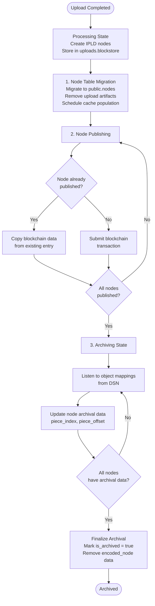

# File State Lifecycle

A file goes through the following states after upload completion:

- **Processing**: Nodes have been migrated to `public.nodes` but no nodes have been published to the blockchain yet
- **Publishing**: Some nodes have been published to the blockchain, but not all
- **Archiving**: All nodes are published to the blockchain, awaiting DSN confirmation via object mappings
- **Archived**: All IPLD nodes for the file are retrievable from DSN, and the object is marked as archived

## Detailed Steps

### 1. Node Table Migration

After upload completion, nodes are migrated from the `uploads.blockstore` to the `public.nodes` table. This process:

- Extracts all IPLD nodes from the upload's blockstore
- Saves them to `public.nodes` with metadata (`root_cid`, `head_cid`, `type`, `encoded_node`)
- Removes upload artifacts (like temporary file chunks from multipart uploads)
- Schedules cache population for the object
- Schedules node publishing (for root uploads)

**Note**: Cache population is scheduled at this stage to pre-populate the download cache while nodes are still available in the database.

### 2. Node Publishing

Once nodes are migrated, the on-chain publisher processes them for blockchain publication:

- **Filters unpublished nodes**: Identifies nodes that haven't been published to the blockchain yet
- **Publishes new nodes**: Submits unpublished nodes as blockchain transactions using the `system.remark` method
- **Handles duplicate nodes**: If a node with the same CID was already published (possibly from a different upload), the publisher copies the blockchain data (`block_published_on`, `tx_published_on`, `piece_index`, `piece_offset`) from the existing entry. This means nodes with the same CID but different `root_cid` or `head_cid` will share the same blockchain publication data.

Nodes are considered "published" once they have `block_published_on` and `tx_published_on` values set.

### 3. Object Mapping Listening & Archiving

The `objectMappingListener` service subscribes to object mappings created on the DSN. This process ensures files are only marked as archived when all their IPLD nodes are retrievable from the network.

**Archival Process**:

1. **Listen for object mappings**: The listener receives object mappings that indicate nodes are theoretically accessible on the DSN (they may not be immediately accessible if pieces haven't been plotted yet, but this is the best available signal)

2. **Update node archival data**: For each received object mapping:
   - Converts the object mapping hash to a CID
   - Checks if the CID corresponds to a node awaiting archival
   - Updates the node's archival data (`piece_index`, `piece_offset`) in the `nodes` table

3. **Check archival status**: After updating archival data, the system checks if any objects have all their nodes archived:
   - Queries all non-archived objects
   - For each object, verifies if all its nodes have archival data (`piece_index` and `piece_offset` are set)
   - If all nodes are archived, triggers the `object-archived` task

4. **Finalize archival**: When the `object-archived` task executes, it:
   - Marks the object as archived by setting `is_archived = true` in the `metadata` table
   - Removes the `encoded_node` field (sets to `NULL`) for all nodes with matching `root_cid` to free up database storage, since the data is now retrievable from DSN

**Note**: Cache population happens earlier (during migration), not during archiving. The cache is populated while nodes are still in the database, before they're removed during archival finalization.
