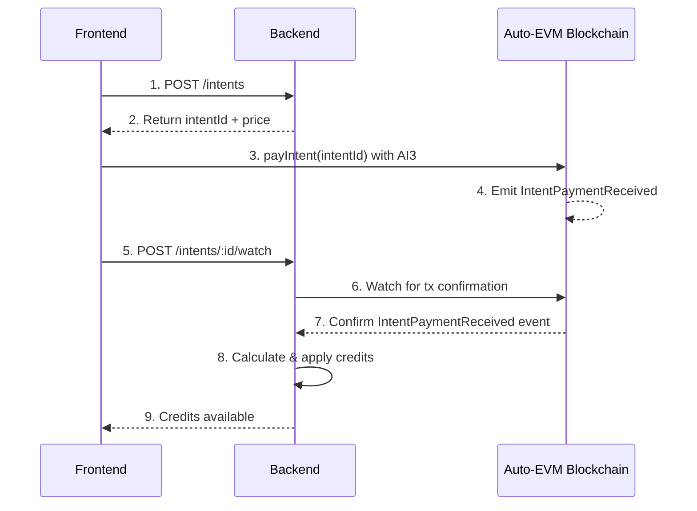
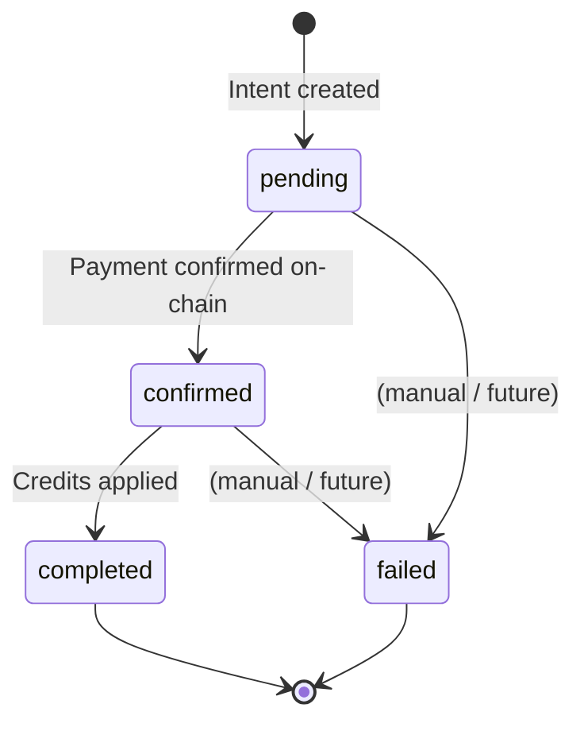

# Pay with AI3: Payment System Documentation

This document describes the payment system for purchasing **credits (bytes)** on Auto Drive using AI3 (the native token on Auto-EVM).

## Overview

Auto Drive uses a credit-based system. Users pay with AI3 on **Auto-EVM**, and the backend turns that payment into credits on the user’s account. The system uses **payment intents** to track and verify transactions.

Operationally, crediting is **asynchronous** and happens in two phases:

1. **Confirm on-chain payment** by observing an `IntentPaymentReceived(intentId, paymentAmount)` event.
2. **Apply credits** on a periodic interval by processing intents in `confirmed` state.

## Architecture



## Payment Flow

### Step 1: Create Payment Intent

The frontend requests a new payment intent from the backend. This reserves the current price and generates a unique `intentId`.

```bash
POST /intents
Authorization: Bearer <api-key>
X-Auth-Provider: apikey
```

**Response:**

```json
{
  "id": "0x1234...abcd",
  "userPublicId": "user-uuid",
  "status": "pending",
  "shannonsPerByte": "1000000"
}
```

### Step 2: Get Current Price

Optionally, check the current price before creating an intent:

```bash
GET /intents/price
```

**Response:**

```json
{
  "price": 1000000
}
```

This `price` value is the same unit as `shannonsPerByte` (shannons per byte).

### Step 3: Execute On-Chain Payment

The user signs and sends a transaction to the `AutoDriveCreditsReceiver` contract:

```solidity
// Contract: AutoDriveCreditsReceiver
function payIntent(bytes32 intentId) public payable
```

The `intentId` from step 1 is passed as a parameter, and the payment amount is sent as `msg.value`.

### Step 4: Notify Backend

After the transaction is submitted, notify the backend to watch for confirmation:

```bash
POST /intents/:intentId/watch
Authorization: Bearer <api-key>
X-Auth-Provider: apikey
Content-Type: application/json

{
  "txHash": "0xabc123..."
}
```

### Step 5: Automatic Credit Application

The backend:

1. Watches for the transaction to be confirmed (configurable confirmations)
2. Parses the `IntentPaymentReceived` event from the transaction logs
3. Marks the intent as `confirmed` and stores the `paymentAmount`
4. Periodically processes `confirmed` intents to:
   - calculate credits based on `paymentAmount / shannonsPerByte` (integer division, rounded down)
   - add credits to the user's account
   - mark the intent as `completed`

## Intent Lifecycle



| Status      | Description                               |
| ----------- | ----------------------------------------- |
| `pending`   | Intent created, awaiting on-chain payment |
| `confirmed` | Payment transaction confirmed on-chain    |
| `completed` | Credits successfully applied to account   |
| `failed`    | Payment or credit application failed      |

## Pricing Model

Credits represent **bytes of storage**. The price is calculated as:

```
price = transactionByteFee × priceMultiplier
```

Where:

- `transactionByteFee`: Current fee per byte from the Autonomys consensus chain
- `priceMultiplier`: Configurable multiplier (default varies by environment)

### Credit Calculation

When a payment is received:

```
credits (bytes) = paymentAmount (shannons) / shannonsPerByte
```

The `shannonsPerByte` is locked when the intent is created, ensuring users get the price they were quoted.

### Units

- **Shannons**: The smallest unit of AI3 (1 AI3 = 10^18 shannons)
- **Credits**: Equivalent to bytes of storage capacity

## Smart Contracts

The payment system uses a two-contract architecture: a **Receiver** (public-facing) and a **Treasury** (secure storage).


### Why Two Contracts?

**Permissionless Sweeping**
Anyone can call `sweepAllToTreasury()` on the receiver—no privileged access needed. Bots or community members can help move funds, reducing the risk window if a vulnerability is discovered.

**Minimized Attack Surface**
The receiver is public-facing and accepts arbitrary payments. By keeping it simple (receive → emit → sweep), there's less code that can be exploited. The treasury has minimal logic—`withdraw()`, `setMinimumBalance()`, and `receive()`.

**Operational Flexibility**
The receiver can be upgraded or replaced without moving accumulated funds. Multiple receivers could point to the same treasury. The treasury acts as "cold storage" while the receiver is the "hot" endpoint.

**Access Control Separation**
Different security policies for each contract:

- **Receiver**: Owner can pause operations and update the treasury address
- **Treasury**: Owner can withdraw (above `minimumBalance`) to a specified `recipient` address passed to `withdraw(recipient)`

In production, the treasury owner can be a **multisig** for added security, while the receiver owner might be a faster-acting operational key for emergency pauses.

**Existential Deposit Handling**
Auto-EVM (like Substrate chains) requires minimum account balances. The receiver and treasury both retain a `minimumBalance` so these accounts remain alive (and can continue to sweep/withdraw).

---

### AutoDriveCreditsReceiver

The deployed payment contract that receives AI3 tokens and emits events for the backend to track can be found here: [AutoDriveCreditsReceiver](https://explorer.auto-evm.mainnet.autonomys.xyz/address/0xBa5bed8325183c0807EcBC80C82D40Dc7Ac5cbf7?tab=index).

**Key Functions:**

| Function                         | Description                                 |
| -------------------------------- | ------------------------------------------- |
| `payIntent(bytes32 intentId)`    | Pay for an intent (payable)                 |
| `sweepAllToTreasury()`           | Move all funds to treasury (permissionless) |
| `sweepAmountToTreasury(uint256)` | Move specific amount to treasury            |
| `setTreasury(address)`           | Update treasury address (owner only)        |
| `pause()` / `unpause()`          | Pause/unpause payments and sweeping         |

**Events:**

| Event                                                                               | Description                   |
| ----------------------------------------------------------------------------------- | ----------------------------- |
| `IntentPaymentReceived(bytes32 indexed intentId, uint256 paymentAmount)`            | Emitted when payment received |
| `TreasuryUpdated(address indexed oldTreasury, address indexed newTreasury)`         | Emitted when treasury updated |
| `SweptToTreasury(address indexed caller, address indexed treasury, uint256 amount)` | Emitted when funds swept      |

### AutoDriveTreasury

The deployed treasury contract that holds swept funds can be found here: [AutoDriveTreasury](https://explorer.auto-evm.mainnet.autonomys.xyz/address/0x2919B30468338D991fBFe984B835Fd34F19Ab2A0).

Funds are swept from `AutoDriveCreditsReceiver` to this contract, where only the owner can withdraw.

**Key Functions:**

| Function                              | Description                                   |
| ------------------------------------- | --------------------------------------------- |
| `withdraw(address payable recipient)` | Withdraw funds to recipient (owner only)      |
| `setMinimumBalance(uint256)`          | Update minimum balance to retain (owner only) |
| `receive()`                           | Accept incoming AI3 transfers                 |

**Events:**

| Event                                                           | Description                          |
| --------------------------------------------------------------- | ------------------------------------ |
| `FundsWithdrawn(address indexed recipient, uint256 amount)`     | Emitted when owner withdraws funds   |
| `MinimumBalanceUpdated(uint256 oldMinimumBalance, uint256 new)` | Emitted when minimum balance updated |

**Security:**

- Uses `Ownable2Step` for safe ownership transfers
- Maintains a `minimumBalance` (default 1e12 wei) to preserve the account's existential deposit on Auto-EVM
- Protected against reentrancy via `ReentrancyGuard`

## API Reference

### Create Intent

```
POST /intents
```

Creates a new payment intent with the current price locked in.

**Headers:**

- `Authorization: Bearer <token>`
- `X-Auth-Provider: apikey`

**Response:** `200 OK`

```json
{
  "id": "0x...",
  "userPublicId": "uuid",
  "status": "pending",
  "shannonsPerByte": "1000000"
}
```

### Get Price

```
GET /intents/price
```

Returns the current price per byte in shannons.

**Response:** `200 OK`

```json
{
  "price": 1000000
}
```

### Get Intent

```
GET /intents/:id
```

Retrieves an intent by ID. User must own the intent.

**Headers:**

- `Authorization: Bearer <token>`
- `X-Auth-Provider: apikey`

**Response:** `200 OK`

```json
{
  "id": "0x...",
  "userPublicId": "uuid",
  "status": "pending|confirmed|completed|failed",
  "txHash": "0x...",
  "paymentAmount": "1000000000000000000",
  "shannonsPerByte": "1000000"
}
```

### Watch Intent

```
POST /intents/:id/watch
```

Triggers the backend to watch for the transaction confirmation.

**Headers:**

- `Authorization: Bearer <token>`
- `X-Auth-Provider: apikey`

**Body:**

```json
{
  "txHash": "0x..."
}
```

**Response:** `204 No Content`

## Error Handling

### Common Errors

| Error                              | HTTP Status | Description                                                                |
| ---------------------------------- | ----------- | -------------------------------------------------------------------------- |
| Missing/invalid access token       | 401         | Missing `Authorization` or `X-Auth-Provider` headers                       |
| Intent not found                   | 404         | The intent ID does not exist                                               |
| Forbidden                          | 403         | User does not own this intent                                              |
| Missing or invalid field: `txHash` | 400         | `POST /intents/:id/watch` body missing `txHash` or not a string            |
| Payment not found (async)          | -           | Tx receipt does not contain the expected `IntentPaymentReceived`           |
| Credits not applied (async)        | -           | Intent confirmed, but credit application failed (e.g. non-one-off account) |

### On-Chain Errors

| Error              | Description                 |
| ------------------ | --------------------------- |
| `InvalidAmount(0)` | Payment amount is zero      |
| `EnforcedPause()`  | Contract is paused by owner |

### Recovery

If a payment is made but credits are not applied:

1. Check the intent status via `GET /intents/:id`
2. If stuck in `pending`, call `POST /intents/:id/watch` with the transaction hash
3. If still not working, the backend may need to manually reconcile via event logs

## Configuration

The payment system requires the following environment variables:

| Variable                     | Description                                      |
| ---------------------------- | ------------------------------------------------ |
| `EVM_CHAIN_ENDPOINT`         | RPC URL for Auto-EVM (HTTP)                      |
| `EVM_CHAIN_CONTRACT_ADDRESS` | Address of AutoDriveCreditsReceiver              |
| `EVM_CHAIN_CONFIRMATIONS`    | Number of block confirmations to wait            |
| `EVM_CHAIN_CHECK_INTERVAL`   | Interval to process `confirmed` intents (ms)     |
| `CREDITS_PRICE_MULTIPLIER`   | Multiplier applied to base transaction byte fee  |
| `RPC_ENDPOINT`               | WebSocket endpoint for Autonomys consensus chain |

## Security Considerations

1. **Intent Ownership**: Intents are tied to the authenticated user and cannot be accessed by others
2. **Price Locking**: The `shannonsPerByte` is locked at intent creation to prevent price manipulation
3. **Permissionless Sweeping**: Anyone can sweep funds to the treasury, but funds only go to the pre-configured treasury address
4. **Pausable**: The contract can be paused by the owner in case of emergency
5. **ReentrancyGuard**: All fund-moving functions are protected against reentrancy attacks
